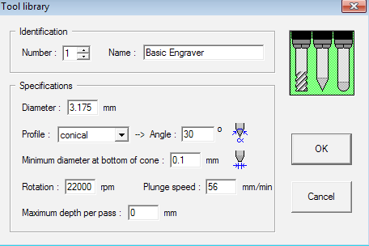
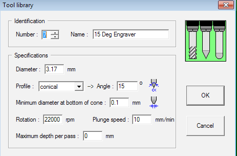
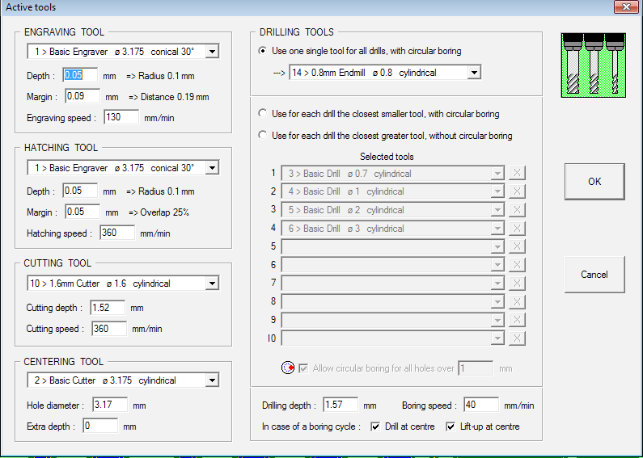
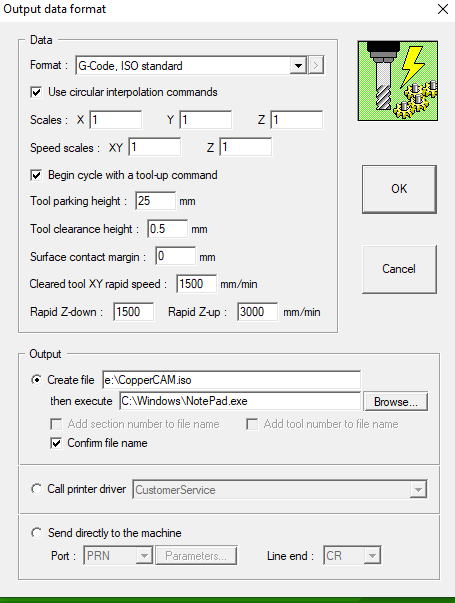

# CAM Software & Post Processors

[CAM Software](https://en.wikipedia.org/wiki/Computer-aided_manufacturing) is required to generate the required gcode for the machine to work with via a machine specific *post-processor*.

Generic GRBL post processors normally work with some modification around how arcs are handled.

## Fusion 360

I've since moved away from using F360 due to the changes in their licensing, however I've had good success with these post-processors in the past.

- <https://github.com/MarkHedleyJones/OmioCNC-Postprocessor>
- <https://brainright.com/wp-content/uploads/2020/10/DDCSV11.txt>

## Copper Cam
[Coppercam](https://www.galaad.net/coppercam-eng.html) is a commercial and very affordable [PCB isolation routing](/pcb) program that I use when I make my PCBs.  It's much easier to use than [FlatCAM](http://flatcam.org/).
### Tool Library

### Output

I found the generic post works correctly with no modifications.

## EstlCam v11

While I haven't used [Estlcam](https://www.estlcam.de/) much, I found the *default* post processor to work just fine with no modifications.
