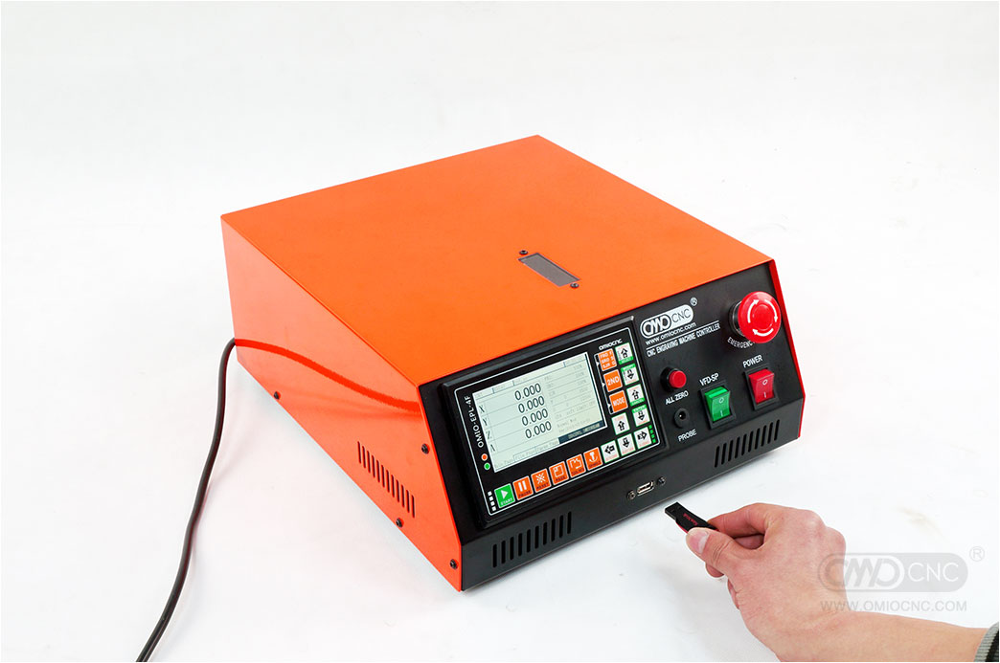

The external enclosure also contains the 4-axis stepper drivers and spindle controller.  Additionally no external PC is required running Mach3 or LinuxCNC as a standalone controller is used, which is a re-branded [DDCS V3.1](http://www.ddcnc.com/?m=home&c=View&a=index&aid=119&lang=en) motion controller.

Manual: [DDCS V31 MANUAL V3.pdf](https://github.com/madeinoz67/omiocnc-x6-2200epl/blob/85a2c01340fbcd62ddb9301e35c8885f39f1baa5/manuals/DDCS%20V31%20MANUAL%20V3.pdf)

Firmware: [install(2020-03-06-112).zip](https://github.com/madeinoz67/omiocnc-x6-2200epl/blob/4c81b5448c813578f27cf4745ffe302afdee7b7f/firmware/install(2020-03-06-112).zip)

{ align=center }
