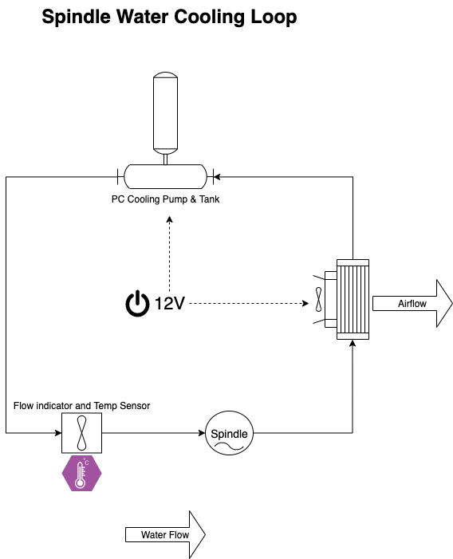

## Features

* Closed loop water cooling
* Swing out easy access maintenance
* Off the shelf components (PC cooling)

## Diagram
{ align=center }

## Coolant

The coolant is general motor coolant rated for alloy and aluminium engines, additionally some algaeside[^1] is added to prevent any bacteria and algae growth.

[^1]: Algaecide active ingredient is [Diuron](https://apvma.gov.au/node/12511)
### Algeacide [^1]

Purchased form local Bunnings hardware store in the ponds section.

!!! warning
    Dose is 5ml / 300l, so not alot is required

{ align=center , loading=lazy }

## Build

{ align=center , loading=lazy }
{ align=center , loading=lazy }
{ align=center , loading=lazy }
{ align=center , loading=lazy }
{ align=center , loading=lazy }
{ align=center , loading=lazy }
### Flow indicator & Temperature Sensor
{ align=center , loading=lazy }

## 3D-printed hose mounting bracket

I designed and 3D-Printed up some print-in-place hose mounting brackets for the cooling loop that have a hidden screw hole.

[6mm Dual Hose Bracket](https://www.thingiverse.com/thing:4578361) on Thingiverse

{ align=center , loading=lazy }
{ align=center , loading=lazy }
