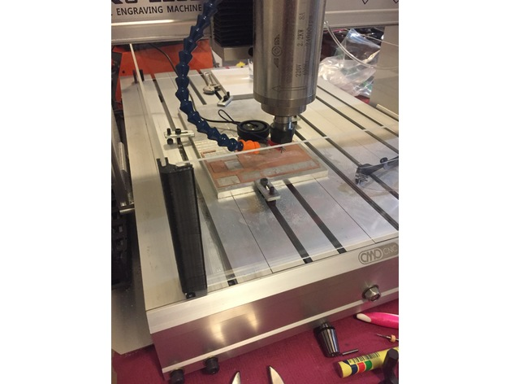
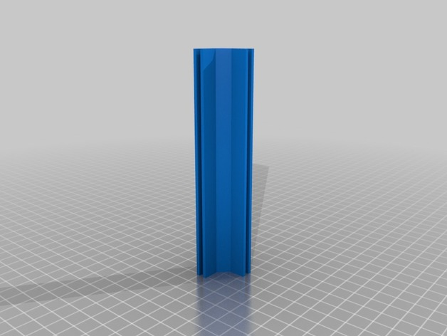

# Simple Chip Shield

A really [simple chip shield](https://www.thingiverse.com/thing:2246287) to stop the chips from making a mess that I designed and available on Thingiverse.
This quick and easy chip shield uses 4 strips of 3mm perspex cut to length and 4 printed corners

{ align=center , loading=lazy }

## Perspex Shield

Adjust lengths of perspex to suit your machine and the printed corners can be adjusted using the customizer here <http://www.thingiverse.com/apps/customizer/run?thing_id=963667>.

2 longest lengths sit in the two outer tooling slots along the Y-Axis. The two shorter lengths sit on top of the bed along X-Axis, all are joined with the 130mm printed corners.

It is easy to assemble and dis-assemble as required.

**3mm Perspex:**

 - 650mm x 150mm (2 each)  
 - 390mm x 135mm (2 each)

!!! note

    The Y-axis are cut such that they **bottom out** and sit in the T-slots length wise with the machine, while align with the **top** of the 3D printed bracket.
    
    The X-axis are cut to be sit on the **top** of the T-Slot base plate, again with their tops level to the **top** of the bracket.  
    
    These are all held together with 3D-printed brackets.

## 3D Printed Brackets

Available on [Thingiverse](https://www.thingiverse.com/thing:2246287)

{ align=center, loading=lazy }
