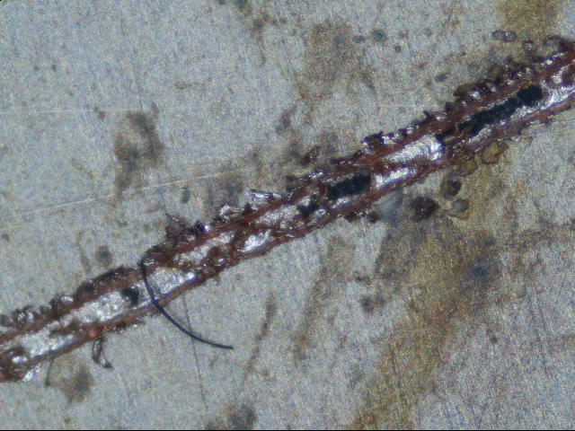

# PCB Isolation Milling

I perform two types of calibrations for PCB isolation routing when using [copper-cam](/cam/#copper-cam) but same can be applied to whatever cam software is being used to mill the PCB.

1. [Width of Cut](#width-of-cut-calibration) 
2. [Sweet Spot](#sweet-spot-test-for-feed-and-speed)

This ensures that the values I have within my software are correct physically, as a v-bit width of cut is dependant on the depth of cut.  Additionally the best sweet spot of the cutting speed is determined.
## Width of Cut Calibration

I originally found infomration about this calibration here <http://phk.freebsd.dk/CncPcb/calibrate.html> but it was in eagle format, Ive since converted to KiCad and ultimately as a [gerber file](https://github.com/madeinoz67/omiocnc-x6-2200epl/blob/57ab4b1096decab5c5dcaf52e2bb4344f321909a/gcode/pcb/IsolationRouterCalibration.gbr).

To find the optimal cutting depth for a V-Bit I use gerber file in copper-cam that steps through track sizes 1-25 mil and track spacings of 1-25 mil.

The object is calibrating the width of cut (WOC) for a given bit within the cam software (copper-cam in this case) and the actual cut on PCB, it also gives and indication of the smallest traces and track clearances achievable with the given bit.
### Example

These two images below are for the WOC or bit width calibration within the Copper-cam, i.e. bits are not normally the size they are suppose to be so the diameter is tweaked in the cutting software, when the upper traces = the lower gaps it means that the size in the software is correct.

Smallest track size on Left of screen is 1mil (1 thousand of inch) also I don't yet have my step-over dialled in and hence why I have some copper artefacts left because of the difference between the advertised cutter size VS calibrated cutter size.

So with the bit diameter calibrated it is showing me that minimum track width is 1mil and min track clearance is 12mil This was done with a 30Deg V-Bit The calibration test starts at traces 1mil up and increments by 1 up to 25 mil this is done on both Traces and Clearances.

Feeds, Speeds and Depth settings.

These are calibration cuts at different feeds and depth, ones showing is for 0.050mm depth of cut, again the ragged edge is VBit engraving bit. Measurement ruler is in 0.1mm increments.

So with my 20Deg Vbit I'm getting ~0.2mm width of cut

## Sweet spot test for Feed and speed

To find the optimal or sweet spot for the feed and speed of a PCB cutter I use the following process:

<https://www.precisebits.com/tutorials/calibrating_feeds_n_speeds.htm>

The attached [gcode](https://github.com/madeinoz67/omiocnc-x6-2200epl/blob/9a9ca2f4a3a47d65ec68a3c9ed30a6ea44f6d38d/gcode/pcb/zigzag_feedrate.gcode)(#zigzag-g-code) runs through a range of feeds and spindle speeds using the zigzag pattern outlined on the above link

### Example

Bits used are:

* 20 Deg Engraving VBit

* 0.6mm PCB Cutter

* 0.4 end mill

You can see the quality of cuts vary between the types of cutter, so is a trade of using the Vbit for the very fine work which give a ragged cut as opposed to very clean cuts for the end mill and PCB cutter. (the board is easily cleaned up with fine emery board or wet n dry so is not an issue)

Here you can see zoomed in that the fine tipped V-Bit does not like faster feed speeds as it starts to deflect and not cut properly, sort of bounces over the surface and not cutting deep enough.

### zigzag g-code

see [gcode library](/gcode/#zigzag-pcb-feedrate-sweet-spot)

## Challenges

### Auto levelling

Currently I don't probe the surface of the PCB as the controller wont perform automatic Z-axis compensation like MACH4 or LinuxCNC does (the only downside I found so far of using the standalone controller vs PC controller), this is whats really needed for v-bits to compensate the depth of cut for the irregularities of the copper substrate surface so that the width of cut remains constant.

One workaround to the v-bit issue and not having Z-axis compensation via surface probing is to use a micro mill cutter, this way all WOC are consistent no matter the depth of cut.

Another method, yet still un-tested, is the DDCS V3.1 controller does allow a surface to be probed and written to a file on the USB, this probing file can be read by [g-code ripper](https://www.scorchworks.com/Gcoderipper/gcoderipper.html#changelog) and a surface mapping can then be applied to the generated PCB g-code generated by copper-cam. 

Related blog post: <http://www.scorchworks.com/Blog/auto-probing-with-g-code-ripper/>

DDCS support was added in v0.22 of g-code ripper.

